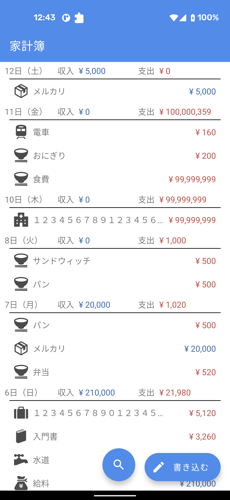
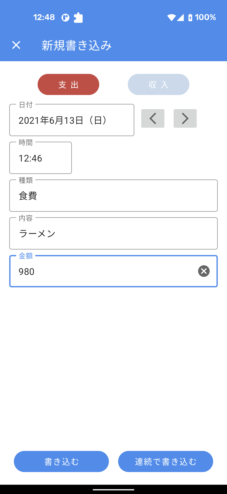
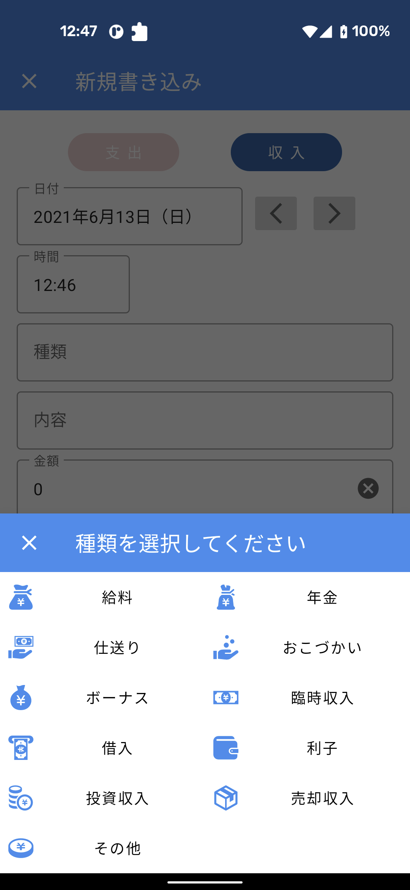
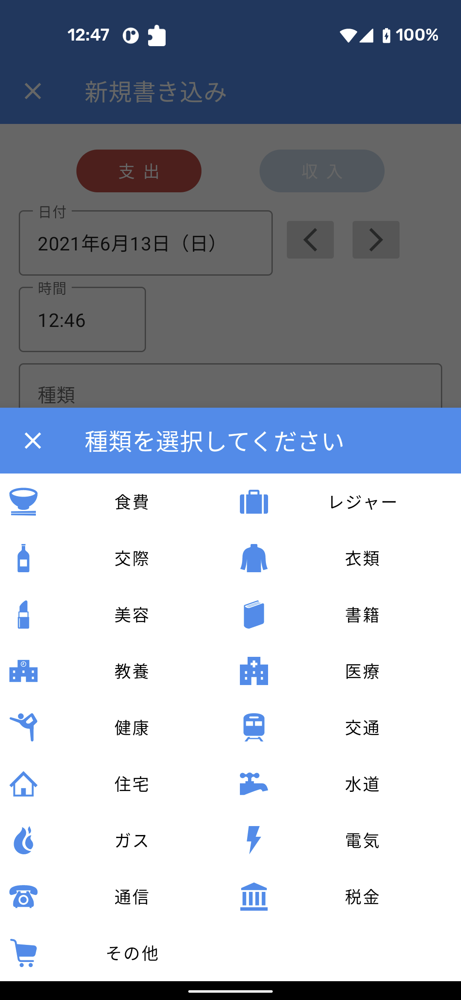

# かけいノート
スマホで家計簿を管理できるAndroidアプリを開発します。

## 開発環境
- 言語：Kotlin 1.5.20
- IDE：Android Studio 4.2.2

## 画面
以下は、2021年6月13日現在の画面イメージです。

| 家計簿画面 | 新規書き込み画面 | 種類選択画面（収入） | 種類選択画面（支出） |
| :--- | :--- | :--- | :--- |
|  |  |  |  |

## 導入技術
### Kotlin
- Coroutines

### Gradle
- Kotlin DSL

### Android Jetpack
- ConstraintLayout
- RecyclerView
- LiveData
- ViewModel
- Navigation
- View Binding
- Data Binding
- Room

### その他
- [Material Components for Android](https://github.com/material-components/material-components-android)
- [Flipper](https://fbflipper.com/)
- (予定)[Hyperion](https://github.com/willowtreeapps/Hyperion-Android#readme)
- [LeakCanary](https://square.github.io/leakcanary/)
- [Logger](https://github.com/orhanobut/logger#readme)
- (予定)[Kotpref](https://chibatching.github.io/Kotpref/)
